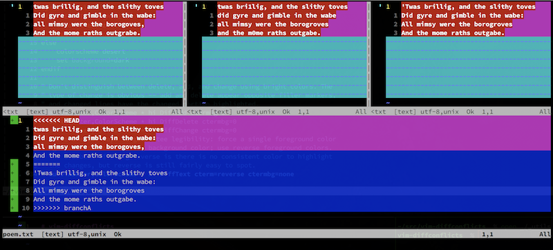
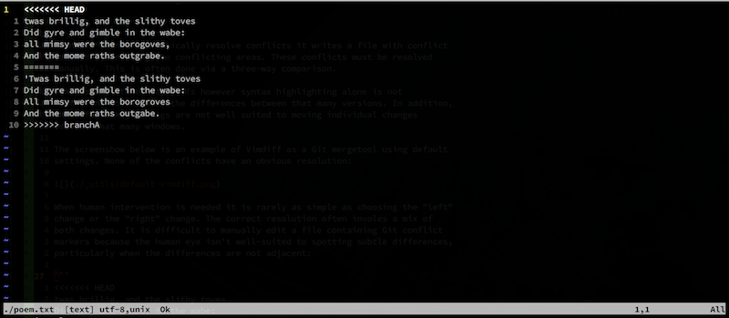
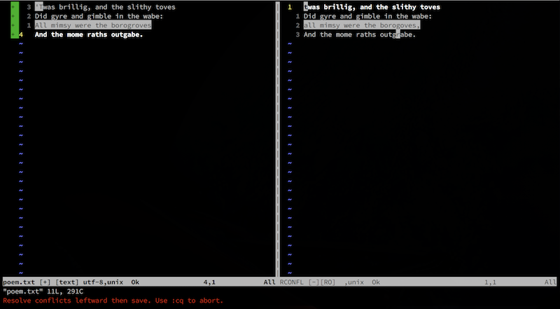

# vim-diffconflicts

A better Vimdiff Git mergetool

tl;dr:

* Call `:DiffConflicts` to convert a file containing conflict markers into
  a two-way diff.
* Install as a Git mergetool to do that automatically. (See
  [Installation](#installation) below.)

## Why?

Watch a demonstration version of this README on YouTube:

[](https://www.youtube.com/watch?v=Pxgl3Wtf78Y)

### Three-Way Diffs are Hard

When Git cannot automatically resolve conflicts it writes a file with conflict
markers surrounding the conflicting areas. These conflicts must be resolved
manually. This is often done via a three-way comparison.

Vim supports three-way diffs however syntax highlighting alone is not
sufficient to showcase the differences between that many versions. In addition,
the default keybindings are not well suited to moving individual changes
between that many windows.

The screenshot below is an example of Vimdiff as a Git mergetool using default
settings. None of the conflicts have an obvious resolution:



### Editing Conflict Markers is Hard

When human intervention is needed it is rarely as simple as choosing the "left"
change or the "right" change. The correct resolution often involves a mix of
both changes. It is difficult to manually edit a file containing Git conflict
markers because the human eye isn't well suited to spotting subtle differences,
particularly when the differences are not adjacent:



### Two-Way Diffs are Eas(ier)

A two-way diff more simply highlights just the relevant differences which makes
the resolution more clear. The merge base and history of each version of the
conflict is a useful reference to learn the intent of each conflicting change,
however those are not as useful to see in the diff.

Vimdiff is well suited to two-way diffs:



### Conflict-Markers are a Two-Way Diff

Git does an admirable job of automatically resolving conflicts. We want to
retain all the work and resolve only the things that Git could not. That work
is reflected in the files containing conflict markers, but it is not reflected
in a two-way diff between LOCAL and REMOTE.

Rather than editing the conflict markers directly, it is better to perform a
two-way diff on just the "left" and "right" sides of the conflict markers by
splitting them apart.

## Installation

1.  Install this plugin using your favorite Vim plugin manager, or just clone
    the repo into your packages directory (see `:help packages`).

2.  Configure Git to use this plugin as a mergetool:

    ```
    git config --global merge.tool diffconflicts
    git config --global mergetool.diffconflicts.cmd 'vim -c DiffConflicts "$MERGED" "$BASE" "$LOCAL" "$REMOTE"'
    git config --global mergetool.diffconflicts.trustExitCode true
    git config --global mergetool.keepBackup false
    ```

    Or, if you'd prefer to always open both the diff view and the history view
    call `DiffConflictsWithHistory` instead:

    ```
    git config --global mergetool.diffconflicts.cmd 'vim -c DiffConflictsWithHistory "$MERGED" "$BASE" "$LOCAL" "$REMOTE"'
    ```

3.  During a merge you can call `:DiffConflictsShowHistory` to open a new tab
    containing the merge BASE and full copies of the LOCAL and REMOTE versions
    of the conflicted file. This can help to understand the history or intent
    behind the conflicting changes to help you decide how best to combine the
    changes.

    This tab is not opened by default so that Vim starts more quickly.
